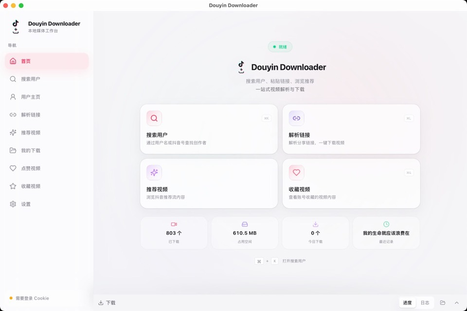
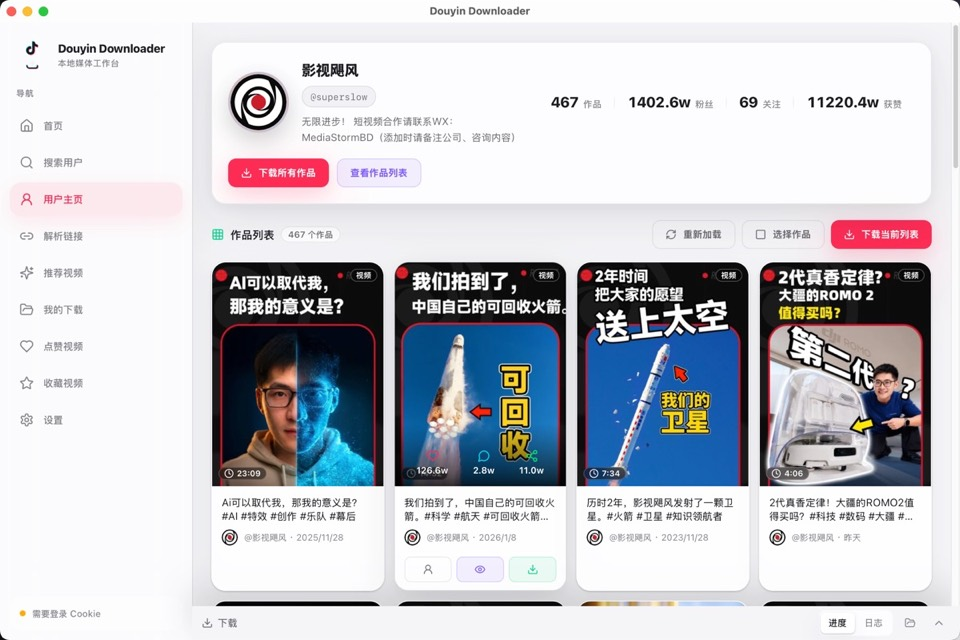

<div align="center">


# better-douyin-R

更轻、更快的 Rust / Tauri 版抖音桌面工具。公开源码保留前端 UI、mock bridge 和协作边界；完整可用应用请下载 Releases。

<p>
  <a href="https://github.com/anYuJia/better-douyin-R/releases/latest"></a>
  <a href="https://github.com/anYuJia/better-douyin-R/releases"></a>
  <a href="https://github.com/anYuJia/better-douyin-R/stargazers"></a>
  
  
  
  
  <a href="LICENSE"></a>
</p>

[下载完整应用](#下载完整应用) · [功能能力](#功能能力) · [界面预览](#界面预览) · [源码说明](#源码说明) · [协作边界](#协作边界)

</div>

---

## 项目定位

better-douyin-R 是 better-douyin 的 Rust / Tauri 桌面版本，重点放在更轻的运行时、更稳定的本地播放、更顺滑的桌面体验和更可靠的跨平台分发。

需要直接使用完整功能的用户，请从 [Releases](https://github.com/anYuJia/better-douyin-R/releases/latest) 下载发行版。发行版是完整应用；当前公开源码是 **Open Shell**，用于展示 UI、组件结构、mock 流程和协作边界。

公开源码适合：

- 了解产品界面、交互和前端架构
- 改进 UI / UX、主题、组件、响应式和可访问性
- 给其他 AI 或协作者提供安全上下文
- 基于同一前端契约接入你自己有权维护的服务

公开源码不包含真实平台连接器、签名、Cookie、加密、真实接口、下载解析或发布密钥。

## 下载完整应用

完整应用在 [Releases](https://github.com/anYuJia/better-douyin-R/releases/latest) 发布。普通用户建议直接下载 Release，不需要从源码构建。

## 功能能力

完整发行版包含以下能力：

- 搜索用户，查看主页作品、收藏、点赞等内容
- 解析分享链接，支持视频、图集和部分 Live Photo 内容
- 批量下载用户作品、搜索结果、推荐流、收藏列表和点赞列表
- 沉浸式播放器支持多媒体切换、进度控制、音量控制、倍速、清晰度切换和失败重试
- 播放器支持自动播放下一条作品，可在播放界面快速开关
- 支持下载视频原声 / BGM，并写入下载任务和下载记录
- 推荐流预览支持滚轮切换、快速播放和一键下载
- “我的下载”支持任务进度、文件视图、作品视图、搜索、播放、定位和删除
- Cookie、配置、下载历史和本地文件均保存在本机

公开源码中的 mock bridge 会返回演示数据，方便运行 UI，但不会访问真实平台。

## 界面预览

<p align="center">
  <a href="docs/preview/home.jpg"></a>
  <br>
  <strong>首页 / 主界面</strong>
</p>

<p align="center">
  <a href="docs/preview/get_user.jpg"></a>
  <br>
  <strong>搜索用户</strong>
</p>

<p align="center">
  <a href="docs/preview/user_detail.jpg"></a>
  <br>
  <strong>用户主页 / 批量下载</strong>
</p>

<p align="center">
  <a href="docs/preview/recommend.jpg"></a>
  <br>
  <strong>推荐视频流</strong>
</p>

<p align="center">
  <a href="docs/preview/playvideo.jpg"></a>
  <br>
  <strong>沉浸式播放器</strong>
</p>

## 源码说明

本仓库源码是公开壳子，用于运行 UI demo 和协作改进。完整可用应用请下载 Releases：

```bash
npm --prefix frontend install
npm run dev
```

构建前端：

```bash
npm run build
```

预览构建产物：

```bash
npm run preview
```

## 项目结构

```text
.
├── frontend/                 # React UI shell
│   ├── src/                  # 页面、组件、stores、hooks、类型契约
│   └── public/               # 图标和静态资源
├── docs/
│   └── adapter-boundary.md   # 前端适配器边界
├── OPEN_SOURCE.md            # 开源壳发布策略
├── SECURITY_BOUNDARY.md      # 永不公开的内容边界
└── README.md
```

## 技术栈

| 模块 | 技术 |
|:---|:---|
| 桌面运行时 | Rust, Tauri 2 |
| 前端界面 | React, Vite, TypeScript, Tailwind CSS |
| 状态与交互 | Zustand, Radix UI, lucide-react, framer-motion |
| 公开边界 | 前端 UI + mock bridge |
| 完整发行版运行时 | Rust / Tauri 桌面运行时 |
| 打包分发 | Releases 提供完整应用 |

## 协作边界

欢迎贡献：

- UI / UX 改进
- 组件拆分、主题、响应式、可访问性
- mock 数据和本地 demo 流程
- 前端 mock 数据、错误状态、空状态和日志展示等通用工程能力
- 文档、截图、开发体验和安全边界说明

不接受：

- 真实接口、签名、加密、Cookie、风控、逆向或绕过逻辑
- 抓包数据、真实凭据、账号数据或非公开实现片段
- 高并发采集、自动化批量请求或任何可能违反平台规则的功能

更多说明见：

- [OPEN_SOURCE.md](OPEN_SOURCE.md)
- [SECURITY_BOUNDARY.md](SECURITY_BOUNDARY.md)
- [docs/adapter-boundary.md](docs/adapter-boundary.md)

## 给 AI 协作者

如果你是 AI 助手，请优先在公开边界内工作：

1. 先阅读 `SECURITY_BOUNDARY.md` 和 `docs/adapter-boundary.md`。
2. 只修改前端 UI、mock bridge、文档和通用开发体验。
3. 遇到真实平台接口、Cookie、签名、加密、下载解析、发布密钥等需求时，停止并说明该内容不属于公开源码范围。
4. 不要凭空补全真实接口，不要生成绕过逻辑，不要把示例 mock 改成真实平台请求。

## 加入交流群

<p align="center">
  
  <br>
  <strong>QQ群：438407379</strong>
</p>

## 免责声明

本项目按“现状”提供。使用者应自行确认使用目的、改动内容和运行环境符合所在地法律法规、平台规则、版权规则和数据保护要求。请只在合法、授权、非商业、无害的场景中使用。

<p align="center">如果这个项目对你有帮助，欢迎 Star 支持。</p>
